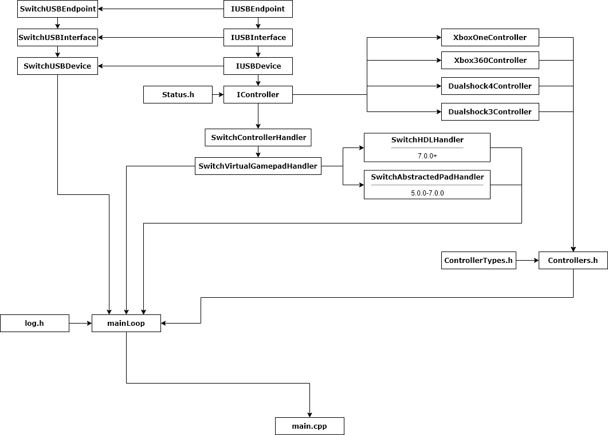

## Components
- **AppletCompanion**: The homebrew application for interfacing with the sysmodule.
- **ControllerLib**: The controller driver library. Since it is up to the user to provide the USB implementation, this library becomes platform independent. To use it, one must inherit abstract classes `IUSBDevice`, `IUSBInterface`, `IUSBEndpoint` and implement them for your target platform.
- **ControllerSwitch**: The switch implementation for **ControllerLib**. It contains the wrappers for the abstract classes, as well as classes responsible for creating a virtual controller on the switch.
- **Sysmodule**: The background process that does all the work. Responsible for detecting controllers and holding controller information, applying any changes in the config, writing to log.

## File structure (sysmodule)

